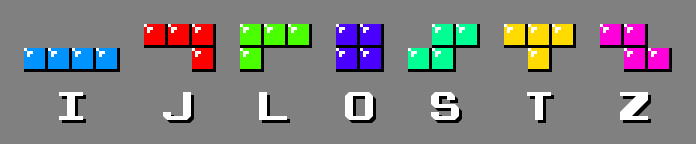

# Megerősítéses tanulás kötelező program

A feladat egy tetris ágens készítése. A játék a tetris egy egyszerűsített változata, ahol minden lépésben egy elemet kell ledobnunk.

Egy lépésben két paramétert kell beállítanunk, hogy melyik oszlopba rakjuk le az elemet, és, hogy az elem a 4 forgatási iránya közül melyikbe álljon.

<p align="center">
  <br/>
</p>

# Tetris

A tetris lényege, hogy a kjelzőn fentről lefele haladó 7 féle tetromino elemet úgy helyezzük el, hogy azok minél kevesebb lyukat hadjanak egymás között. Ha egy sor minden eleme lefedésre kerül, akkor az a sor eltűnik, több helyet hagyva az új elemek elhelyezésére. [Részletes szabályok](https://tetris.wiki/Tetris_Guideline).

A játékot bárki kipróbálhatja például az alábbi oldalon: [tetr.io](https://tetr.io/)


A 7 féle tetromino-t névvel ellátva az alábbi ábra tartalmatta:
<p align="center">
  <br/>
</p>


# Környezet

A környezetben minden lépés egy elemleejtése a tábla tetejéről. 

|   |   |
|-------------------|------------------------------|
| Action space      | <pre>MultiDiscrete([*boardWidth*  4])</pre> |
| Observation space | <pre>Dict(<br>  board: Box(0, 1, (*boardHeight*, *boardWidth*))<br>  piece: Discrete(7)<br>)</pre>|

Ahol a *boardWidth* és *boardHeight* a tábla szélességét és magásságát jelölik.

Akciók:
 - A lehetséges akciók első paraméterének annak az oszlopnak a számát kell megadnunk 0-tól indexelve, amelyikbe az adott elem legbaloldalibb kockáját szeretnénk rakni. Ha az általunk megadott oszlopba már nem lehetséges elemet rakni (például egy "Z" elemet akarunk az utolsó oszlopba rakni), akkor a legjobboldalibb még lehetséges oszlpba fogja ranki a rendszer.
 - A második paraméter az elforgatás, ami minden elem esetén 4 irány lehet, mégha bizonyos elemeknél ezek át is fednek.

Megfigyelések:
 - A megfigyeléseket egy Dictionary-ben kapjuk meg, aminek két kulcsa van: a *board* és a *piece*.
 - A *board* egy 2 dimenziós tömbben tartalmazza a jelenlegi táblát, ami 0, ha a mező még üres és 1, ha már tettünk oda elemet.
 - A *piece* egy egész szám, ami a lerakandó tetromino azonosítóját tartalmazza, a az értéke 0-tól az elemek száma - 1 tart. Mivel az elemek száma környezetenként eltérhez, ezért egy adott tertominohoz külön környezetekben külön azonosítók tartozhatnak.
 - Mivel a környezet egy Dictionary-ben tér vissza az elemekkel a *stable-baselines3* esetén alapértelmezettként a [MultiInputPolicy](https://stable-baselines3.readthedocs.io/en/master/modules/ppo.html#stable_baselines3.ppo.MultiInputPolicy) használata ajánlott. (Lásd: példa kódok)

 A környezet a *TetrisGym* osztállyal példányosítható, az alábbi módon:
 ```
 from tetris_gym.envs.tetris_gym import TetrisGym

 env = TetrisGym(width=6, height=14, pieces=["O", "I", "J", "L"])
 ```

 Ahol a 3 játékmenet befolyásoló paraméter az alábbiak:
  - *width*: a tábla szélessége
  - *height*: a tábla magassága
  - *pieces*: A játékban használható tetrominok neve, lehetséges értékek: *O, I, J, L, T, S, Z*

# Pontszámítás

Minden lerakott elem 1 pontot ér. Ha egy lerakott elem hatására eltűnnek sorok, akkor ez az eltűnt sorok száma a négyzeten szorozva a tábla szélességével további jutalmat jelent.

$$ score = 1 + clearedLines^2 * boardWidth $$

Ahol a *clearedLines* az eltűntetett sorok számát a *boardWidth* pedig a pálya méretét jelenti.
Ha mondjuk egy hagyományos 10 széles pályát egy lépéssel 3 sort eltüntetünk, akkor $ 1 + 3^2 * 10 = 91 $ pontot kapunk.

Az alapértelmezett jutalom megegyezik a pontokkal.

# Telepítés

A rendszer egyaránt használható google colabon és hagyományos számítógépeken. A környezet egy átlagos laptop processzorán is kényelmesen futtatható.

Az alábbi példában [conda](https://docs.conda.io/en/latest/) virtuális környezetet fogunk használni.

Conda környezet létrehozása:

```
conda create -n tetris_gym python=3.10
conda activate tetris_gym
```

Rendszer letöltése és a csomagok telepítése:

```
git clone https://github.com/szegedai/tetris_gym_szte.git

cd tetris_gym_szte

pip install -r requirements.txt
```

Példakód kipróbálása:

```
python example.py
```

## Kiértékelés és követelmények

Hamarosan.

## Köszönenyílvánítás

Köszönet  [Viet Nguyen])(https://github.com/uvipen)-nek a tetris környezet alapjaiért.